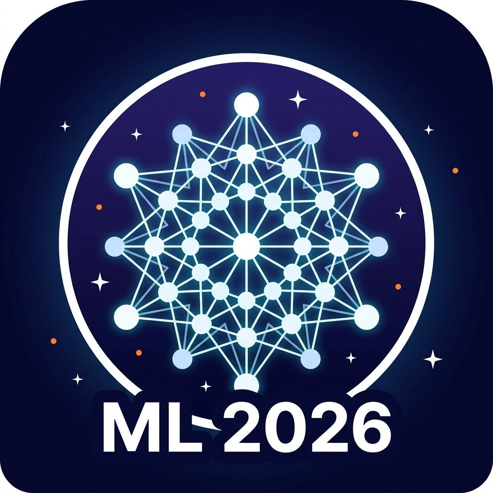

<h1 align="center">Machine Learning Study in 2026</h1>

   

## Weekly Presentation

| Week |    Date    |                   Lecturer                    |          Contents          |                                                                              Refs & Materials                                                                               |
|-----:|:----------:|:---------------------------------------------:|:--------------------------:|:---------------------------------------------------------------------------------------------------------------------------------------------------------------------------:|
|    1 | 2026-03-20 | [Soojin Lee](https://github.com/LSJ957) | Topological Data Analysis (TDA) | [Tutorial Part 1 (Notebook)](./01-TDA/TDA_Tutorial_Part1.ipynb) [Tutorial (Notebook)](./01-TDA/tutorial_TDA.ipynb) |
|    2 | 2026-04-17 | [Tae-Geun Kim](https://github.com/Axect) | Agentic Science Research Part 1 | [Slide (PDF)](https://www.dropbox.com/scl/fi/ixv21mh5h04b51pbyx7vo/main.pdf?rlkey=zm9sseadml7hij8zl5n1xjxc2&dl=0) |
